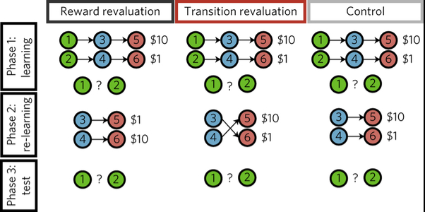

Reference: Momennejad, I., Russek, E.M., Cheong, J.H. et al.
The successor representation in human reinforcement learning. Nat Hum Behav 1, 680–692 (2017). 
https://doi.org/10.1038/s41562-017-0180-8

\<states>

    0: Lobby

    1: Room 1

    2: Room 2

    3: Room 3

    4: Room 4

    5: Room 5

    6: Room 6

\<rewards>

    5: 10

    6: 50

\<transitions>

    0 -> 1

    0 -> 2

    1 -> 3

    1 -> 4

    2 -> 5

    2 -> 6        
