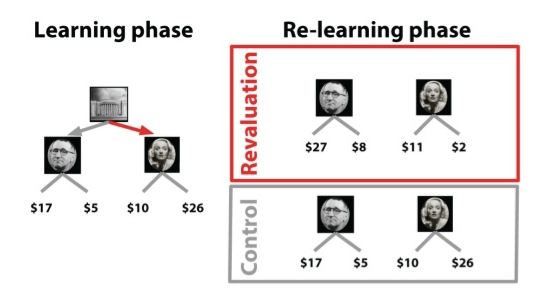

Reference: Momennejad, I., Otto, A. R., Daw, N. D., & Norman, K. A. (2018). Offline replay supports planning in human reinforcement learning. eLife, 7, e32548. https://doi.org/10.7554/eLife.32548

\<states>

    0: Lobby

    1: Upstairs Brecht

    2: Upstairs Left Room

    3: Upstairs Right Room

    4: Downstairs Madonna

    5: Downstairs Left Room

    6: Downstairs Right Room

\<rewards>

    2: 10

    3: 50

    5: 56

    6: 22

\<transitions>

    0 -> 1

    0 -> 4

    1 -> 2

    1 -> 3

    4 -> 5

    4 -> 6
